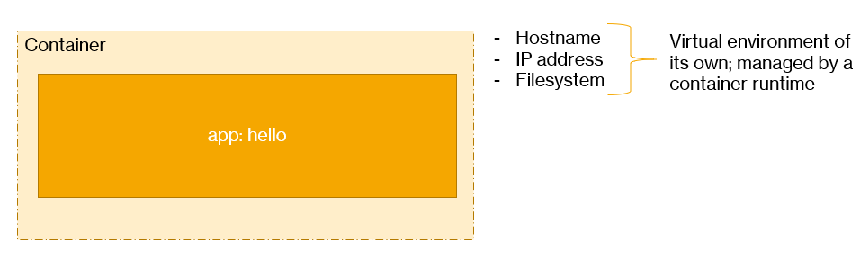
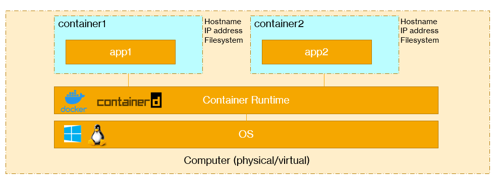

# What is a container?

Usually, containers are isolated from eachother using **Linux Container** features such as:
- Linux namespaces: partitions kernel resources such as process IDs, hostnames, ...
- cgroups: kernel feature to limit and isolate resources such as CPU, memory, ...

Containers are run by a container runtime. We usually think of Docker, which actually uses **containerd**. The containerd runtime can also be used without Docker. Current versions of Kubernetes typically use that runtime. Azure Kubernetes Services (AKS) uses containerd directly on its Ubuntu nodes.

There are other ways to provide isolation as well such as:
- Google gVisor
- VM-based containers: Hyper-V on Windows can actually be used to provide this isolation for Windows containers; see [docs](https://docs.microsoft.com/en-us/virtualization/windowscontainers/manage-containers/hyperv-container) for more info

