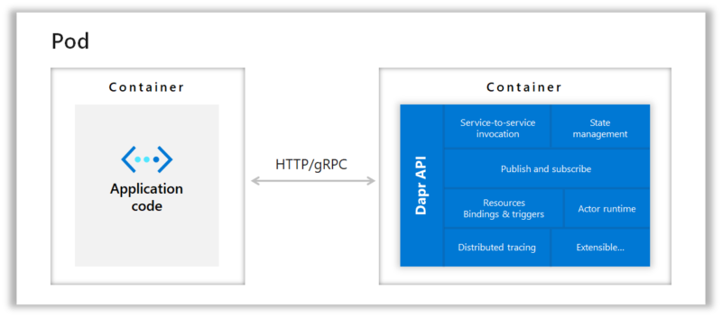

# Deploying Pods

A pod is the basic unit of deployment in Kubernetes.

From the Kubernetes documentation: 

> A Pod (as in a pod of whales or pea pod) is a group of one or more containers, with shared storage and network resources, and a specification for how to run the containers. A Pod's contents are always co-located and co-scheduled, and run in a shared context. A Pod models an application-specific "logical host": it contains one or more application containers which are relatively tightly coupled. In non-cloud contexts, applications executed on the same physical or virtual machine are analogous to cloud applications executed on the same logical host.

In many cases, your pod will only container one container, your application container. If you are using solutions such as service meshes or dapr, those solutions run an extra container in your pod, next to your application container.



In this example, the dapr container follows the sidecar pattern. The dapr sidecar can be injected automatically. Other solutions that use sidecars, such as service meshes, work similarly.

A pod can be deployed with the following manifest:

```yaml
apiVersion: v1
kind: Pod
metadata:
  name: pods-simple-pod
spec:
  containers:
    - command:
        - sleep
        - "3600"
      image: busybox
      name: pods-simple-container
```

**Tip:** the above is from https://github.com/ContainerSolutions/kubernetes-examples/blob/master/Pod/simple.yaml; the repository contains many other Kubernetes YAML manifest examples in great detail: https://github.com/ContainerSolutions/kubernetes-examples

A pod can run multiple containers:

```yaml
apiVersion: v1
kind: Pod
metadata:
  name: pods-multi-container-pod
spec:
  containers:
    - image: busybox
      command:
        - sleep
        - "3600"
      name: pods-multi-container-container-1
    - image: busybox
      command:
        - sleep
        - "3601"
      name: pods-multi-container-container-2
```

A pod can have an init container that needs to finish before the main container is started.

```yaml
apiVersion: v1
kind: Pod
metadata:
  name: init-container-pod
spec:
  containers:
    - name: init-container-container
      image: busybox
      command: ['sh', '-c', 'echo The app is running! && sleep 3600']
  initContainers:
    - name: init-container-init-container
      image: busybox
      command: ['sh', '-c', "until nslookup pods-init-container-service.$(cat /var/run/secrets/kubernetes.io/serviceaccount/namespace).svc.cluster.local; do echo waiting for myservice; sleep 2; done"]

```

