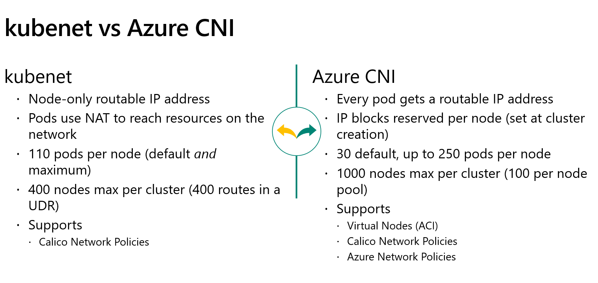

# AKS Deployment

Azure Kubernetes Service (AKS) deployment options:
- Portal
- Azure CLI
- ARM/Bicep/Terraform

# AKS Deployment

Azure Kubernetes Service (AKS) deployment options:
- Portal
- Azure CLI
- ARM/Bicep/Terraform

## Portal

⚠ Let's go through a portal deployment (DEMO)

Considerations:
- Resource group for Kubernetes cluster object + MC_ resource group to hold all the resources for the cluster (scale set, load balancer, ...)
    - you can change the name of the MC_ resource group
- Portal has **recommended configurations** with cost indicatation
    - Standard
    - Dev/Test
    - Cost-optimized
    - Batch-processing
    - Hardened access: private cluster
- Region and availability zones
- Kubernetes version
    - Downgrading is not supported
- Manual scaling or autoscaling (select min and max nodes)
- Node pools
    - System and user node pools
- Virtual nodes
- Virtual machine scale sets (VMSS): default; required for AZ support
- Authentication
    - SP or system-assigned managed identity: MI recommended
    - RBAC: should be enabled
    - AKS-managed Azure Active Directory
- Node pool OS disk encryption: default = encryption at rest with platform-managed key
- Networking
    - Kubenet vs Azure CNI
    - Load Balancer: Standard
    - HTTP Application Routing: simple ingress solution for dev purposes
    - Enable private cluster
    - Authorized IP ranges
    - Network policy: typically deployed but not necessarily enabled



- Integrations
    - Azure Container Registry: select or create new
    - Azure Monitor
    - Azure Policy


## Azure CLI

See https://docs.microsoft.com/en-us/azure/aks/kubernetes-walkthrough

```bash
az group create --name myResourceGroup --location eastus

az aks create --resource-group myResourceGroup  --name myAKSCluster --node-count 1 --enable-addons monitoring --generate-ssh-keys
```

## Deployment with Bicep

See https://github.com/gbaeke/aks-bicep

Also see https://www.youtube.com/watch?v=0fw4UaY9Qd0&t
