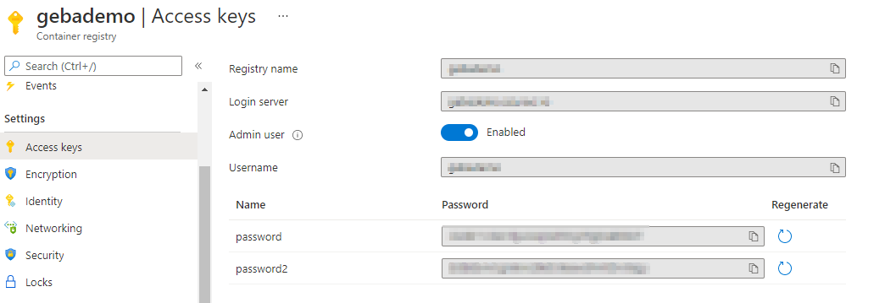
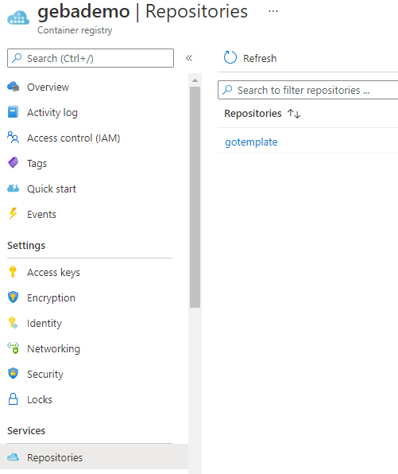

# Pushing containers to a registry

## Docker Hub

If you have a Docker ID, first run docker login:

```
docker login
```

Authenticate with your Docker ID and password. The credentials will be saved depending on configuration. You can use credential stores instead of storing the username and password in $HOME/.docker/config.json (base64-encoded). On my machine, the credential store is desktop.exe. On Windows, you can use **docker-credential-desktop get** to work with that store.

When you are logged in, push the container with:

```
docker push DOCKERID/imagename:tag
```

**Note:** if you omit a tag, the default tag is **latest**; even if you specify a custom tag, the **latest** tag will also be add to that image to ensure the most recent image always has the most recent tag

**Note:** do not use the **latest** tag in production

## Azure Container Registry (ACR)

You can login to ACR with **docker** because it is an OCI-compliant registry:

```
docker login registryname.azurecr.io
```

To login with an admin username and password, enable the Admin user in Access Keys:



**Note:** ACR supports tokens to login to ACR using a token and a password; tokens allow you to set permissions scoped to one or more repositories; this is a **preview** feature

You can also login with the **Azure CLI**:

```
az acr list -o table
az acr login NAME
```

**Note:** NAME is the short name of ACR so without .azurecr.io appended

When you now run **docker-credential-desktop list**, the URL of your ACR should be listed

We can now push the image we tagged earlier. The format of the name is actually:

```
ACRURL/repository:tag
```

The image from the **Build** section earlier had the following name:

```
gebademo.azurecr.io/gotemplate:1.0.0
```

To push this, just issue the following command:

```
docker push gebademo.azurecr.io/gotemplate:1.0.0
```

The result:

```
The push refers to repository [gebademo.azurecr.io/gotemplate]
b1d9c8474591: Pushed
88feb242018f: Pushed
9b7d0b8ffbaa: Pushed
1.0.0: digest: sha256:cc23148b9a17087b1244721b534a2f0fb5a639fd112e3b1a137a983f30aab9cd size: 946
```

Result in ACR:

